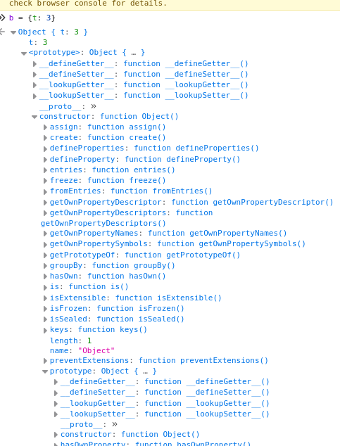

## Modello a prototipi
A differenza degli altri linguaggi, JavaScript adotta fin dalle origini un modello diverso, object-based ma non object-oriented. In cui il concetto di classe viene sostituito dal concetto di prototipo.

- Ad ogni oggetto viene associato dal suo costruttore (oppure si usa un default) un "oggetto padre", il suo prototipo appunto, di cui eredita le proprietà: si parla perciò di **prototype-based inheritance**.

### Definizione di oggetti
Nel modello a prototipi, un oggetto può essere definito sostanzialmente in due modi:
- tramite un object literal, che introduce un singleton
    - non stabilisce relazioni con altri oggetti, né «parentele» fra essi
    - un oggetto di questo tipo ha come prototipo l'oggetto padre
- tramite un costruttore, ossia una funzione particolare, che inizializza l’oggetto ed è invocata per via indiretta, tramite **l’operatore new**

Tutte le proprietà sono pubbliche e modificabili, inoltre, si possono aggiungere e togliere proprietà dinamicamente.

Le proprietà in generale sono pubbliche. Proprietà private possono essere modellate tramite chiusure, che chiudono apposite funzioni-accessor.

### Keyword this
Eventuali "metodi" (non c'è il concetto di classe e quindi è un nome un po' improprio) di un oggetto possono fare riferimento alle proprietà dell’oggetto in cui vengono definite tramite la keyword **this**. 

**OSS**: la keyword this diventa uno strumento di **metaprogrammazione**; permette ai metodi di un oggetto di definirne, eliminare e sovrascrivere proprietà dell'oggetto a runtime.

**NB**: i metodi NON possono essere scritti come lambda expressions, perché queste ultime **non incorporano il riferimento a this**.

### DOMANDA | CHIEDI PER THIS e METAPROGRAMMAZIONE e OGGETTO GLOBALE

## Costruttori
Un costruttore è una normale funzione, che però:
- ha per convenzione un nome che inizia per lettera maiuscola
- è invocata indirettamente, tramite l'operatore **new**
- fa riferimento al suo interno alle proprietà dell’oggetto tramite **this**

**Esempio**:

    Point = function(i,j) {
        this.x = i;
        this.y = j;
        
        this.getX = function(){ return this.x; }
        this.getY = function(){ return this.y; }
        
        this.toString = function() {
            return `Punto (${this.x},${this.y})`;
        }
    }

L’esempio sopra definisce un costruttore che, quando invocato, costruisce un oggetto con 5 **proprietà**: x, y, getX, getY, toString

**ATTENZIONE**: sarebbe stato diverso scrivere questo:

Point = function(i,j) {
    x = i;
    y = j;
    
    getX = function(){ return this.x; }
    getY = function(){ return this.y; }
    
    toString = function() {
        return `Punto (${this.x},${this.y})`;
    }
}

senza "this" non si sta più accedendo (e definendo) alle **proprietà** dell'oggetto riferito dal costruttore, si stanno semplicemento definendo delle variabile implicitamente.

**ATTENZIONE_2**: una funzione costruttore va invocata **implicitamente** con *new* dato che il runtime deve fare un po' di cose:
- bisogna innanzitutto creare un oggetto vuoto a cui verranno aggiunte le proprietà del construttore marchiate da *this*
- bisogna fare un binding tra l'oggetto creato e il riferimento puntato da *this* nella funzione costrutture
    - altrimenti *this* punterebbe all'oggetto globale (che è quello che succede quando si invoca senza *new*) 
- infine bisogna restituire l'oggetto creato. Senza new questo non avverrebbe.

con Funzione costruttrice e operatore new (di fatto si chiama la funzione costruttrice con argomento nascosto uguale alla memoria necessaria)

**ATTENZIONE a THIS: Negli esempi è fondamentale**

**Il qualificatore private non è necessario**; basta usare delle chiusure

...

Le classi fissano la struttura

## Prototipi di oggetti
ereditarietà tra oggetti e non tra classi. Qua è tutto più fluido, non ho la (conveniente) rigidità delle classi

I costruttori predispongono un campo \_\_proto\_\_ che popolono con i prototipi degli oggetti che creano

**perchè ricorsione**?
anche nel prototipo dei literal

