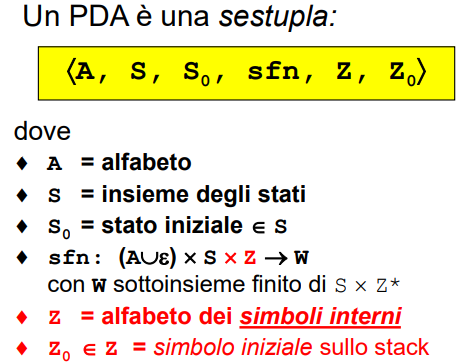

#### LIMITI DEI RICONOSCITORI A STATI FINITI
Un RSF __non può riconoscere un linguaggio di Tipo 2__. Un RSF ha infatti un limite __intrinseco, strutturale e prefissato__, alla propria capacità di memorizzazione (il numero di stati è congelato al momento di definizione della macchina).

Ergo, non riesce a riconoscere frasi che richiedano, per la loro verifica, di memorizzare una parte di lunghezza non nota a priori

ESEMPIO: il bilanciamento delle parentesi

Problema nel dare un upper bound al numero degli stati appropriato
- numero di stati spropositato -> spreco di risorse
- numero di stati contenuto -> facile eccedere
- non si riesce a determinare un numero di stati a priori

NB: tutto cambierebbe se si potesse definire un limite a priori, in quel caso un RSF è sufficiente.

## PUSH-DOWN AUTOMATON (PDA)
Per riconoscere un linguaggio di Tipo 2 serve un nuovo tipo di automa, che superi il limite di memoria finita (limitata a priori) del RSF.

Tale automa dovrà necessariamente appoggiarsi a una struttura dati esterna ad esso, espandibile quanto serve – ad esempio, uno STACK.

Alla fine della fiera se non riesco a determinare il numero di stati a priori gli metto fuori.
- supporto di memoria ulteriore rispetto agli stati -> stack 
- PDA = RSF + STACK

#### DEFINIZIONE PDA

Come un RSF, un PDA legge un simbolo d’ingresso e transita in un nuovo stato; in più, a ogni passo __altera lo stack__. Lo stato futuro e la nuova configurazione dello stack sono  __funzione__ sia del __simbolo d’ingresso__ sia di quello attualmente in __cima allo stack__ (e, chiaramente, dello stato corrente).

    Adesso si può giocare da due parti, posso avere un gran numero di stati e usare poco lo stack o viceversa. Spesso è più conveniente il secondo metodo. 
    
    NB: Il minimo numero di stati è due (uno stato è uguale a non avere stati)

Un PDA può o meno prevedere __epsilone-mosse__, una sorta di transizioni “spontanee” che manipolano lo stack senza consumare simboli di ingresso.
- ha senso tenere le epsilon-moves, per permettere al PDA  di dare una risistemata allo stack -> Mosse spontanee

#### STACK
Formalmente, lo stack è definito come sequenza di simboli, definita in modo tale che si possa operare solo su quello più a destra –> quello "in cima" alla pila.

- stack implementato come __stringa__.

Dentro allo stack non risiede lo stesso alfabeto dei simboli di input in quanto una rappresentazione interna dei dati (comoda per il programmatore) è utile.
- alfabeto Z dei simboli interni.

Inoltre, è furbo imporre che lo stack abbia un contenuto iniziale (esattamente come esiste uno stato iniziale)
- per sapere che cosa c'è al top dello stack bisogna fare una pop, se non c'è niente la macchina si rompe.

__NB__: Il PDA, ad ogni operazione, funziona facendo sempre una pop dallo stack e poi zero o più push.

#### Linguaggio accettato da un PDA
è definibile in 2 modi equivalenti:

- Criterio dello stato finale: come in un RSF, il linguaggio accettato è l’insieme di tutte le stringhe di ingresso che portano il PDA in uno degli stati finali.

- Criterio dello stack vuoto: appoggiandosi al nuovo concetto di stack, il linguaggio accettato è definito come l'insieme di tutte le stringhe di ingresso che portano il PDA nella configurazione di stack vuoto.

#### Takeaway dell'esempio utile
- Un design tipico di un PDA comprende due stati:
    - fase ascendente = accumulo
    - fase discendente = verifica/svuotamento 
    - due stati = minimo necessario. Al della memorizzazione ci pensa lo stack!
- In Z* bisogna ricordarsi di sparare fuori anche quello che si è consumato (se necessario)