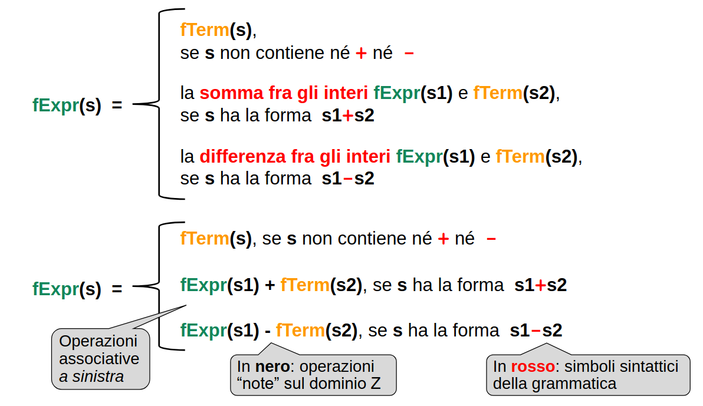
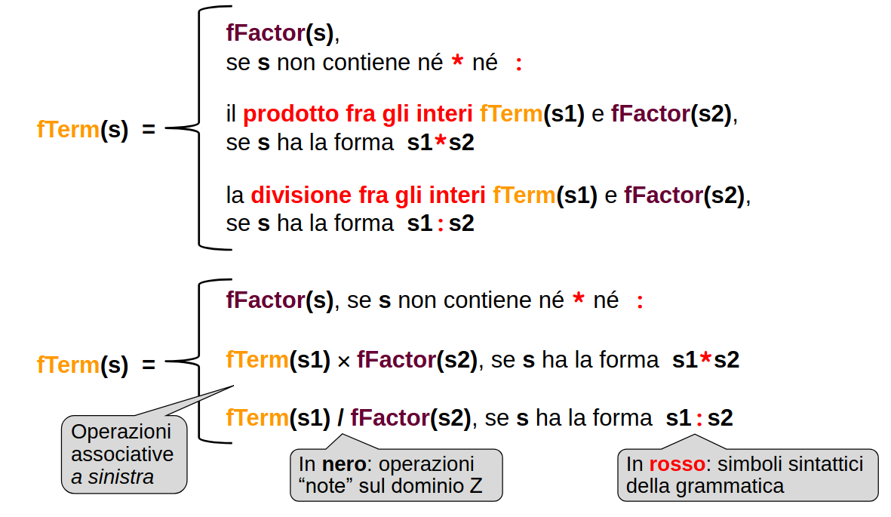

## Interpreti
Finora abbiamo considerato puri riconoscitori, che accettano in ingresso una stringa di caratteri e riconoscono se essa appartiene al linguaggio.

La risposta è del tipo “sì o no”:
- **non ha importanza come si arriva a stabilire se la frase è lecita**
- in particolare, si può sempre sostituire una grammatica con una equivalente, perché al fine del riconoscimento il risultato è identico
- solo sintassi, la sequenza di derivazione non ha importanza

**Ma noi vogliamo anche semantica**, ovvero automi che oltre a riconoscere una frase facciano anche qualcosa
- degli interpreti

Un interprete è più di un puro riconoscitore:
- non solo riconosce se una stringa appartiene al linguaggio..
- ..ma esegue azioni in base al significato (semantica) della frase
    - può svolgerle direttamente -> **valutazione immediata** 
    - o costruire **strutture dati** per permettere di svolgerle in un **secondo tempo**.

Conseguenze:
- **la sequenza di derivazione diventa importante perché contribuisce a definire il significato della frase (semantica)**
- non è detto di poter sostituire una grammatica con una equivalente perché l'equivalenza è tale solo "ai morsetti"

### Struttura degli interpreti
- **Scanner**, l'analizzatore lessicale
    - analizza le parti regolari del linguaggio
    - RSF
    - produce token che da in pasto al parser
- **Parser**, l’analizzatore sintattico-semantico
    - analizza le parti context-free del linguaggio
    - PDA
    - considera come elementi terminali del linguaggio i token prodotti dallo scanner, non i singoli caratteri della frase
    - **valuta la correttezza della sequenza dei token**

### Analisi lessicale**
L’analisi lessicale consiste nella **individuazione delle singole parole (token) che compongono una frase**
- Ciò viene fatto raggruppando i singoli caratteri dell’input secondo le produzioni regolari associate alle diverse possibili categorie lessicali (identificatore, numero, keyword, ecc...)
- L’analizzatore lessicale può **categorizzare i token** mentre li analizza semplicemente **osservando in quale stato finale** del suo RSF si viene a trovare

**NB**: I linguaggi hanno anche token di diverse categorie però riconosciuti con le stesse regole grammaticali (e.g. keyword e identificatori). Per non dover realizzare un RSF complicatissimo, si conviene di fare come in seguito:
- categorizzare in **prima battuta** le parole chiave come identificatori
    - grammatica e struttura RSF molto semplici
- .. salvo poi ri-categorizzarle correttamente in **seconda battuta, consultando opportune tabelle** che incapsulano la conoscenza di dettaglio del linguaggio
    - tabella delle parole-chiave del linguaggio
    - tabella dei simboli speciali del linguaggio
- Spostando, in pratica, la decisione da un piano puramente sintattico a uno sintattico-semantico

### (IMPORTANTE) Analisi sintattica top-down
Con una grammatica LL(1), l'analisi ricorsiva discendente permette di costruire facilmente un riconoscitore. Negli esempi visti, ogni funzione restituiva un boolean.

**Per passare da un puro riconoscitore a un interprete occorre propagare qualcosa di più di un bool**:
- **un valore**, se l'obiettivo è la **valutazione immediata** (interprete) in un qualche dominio
- **un albero**, se l'obiettivo è la **valutazione differita** (compilatore o interprete a più fasi)
    - la vera valutazione nel dominio di interesse avviene più avanti.


## Il caso di studio classico: LE ESPRESSIONI ARITMETICHE
... guarda slide

Nozioni di **priorità** e **associatività**:
- priorità fra operatori diversi
    - gli operatori moltiplicativi sono di solito prioritari su quelli additivi
    - 3+4*5 denota 23, non 35
- associatività fra operatori equiprioritari
    - solitamente si associa a sinistra
    - 9-4-1 denota quattro (9-4)-1, non sei 9-(4-1)
 

### PROBLEMI DELLA PRIMA GRAMMATICA
EXP ::= EXP + EXP
EXP ::= EXP - EXP
EXP ::= EXP * EXP
EXP ::= EXP : EXP
EXP ::= num

- **Ambigua** per ogni espressione non banale (pensa ad n + n + n). 
- **non c'è niente nella grammatica che definisca l'idea di priorità e associatività delle operazioni**

Sarebbe meglio cablare nella grammatica questi concetti in modo da __facilitare l'analisi semantica (?)__ e magari nel contempo eliminare la ambiguità.

Digressione: il meno dei numeri negativi (meno unario) è simbolo con una semantica diversa rispetto al meno delle sottrazioni (meno binario)


## GRAMMATICHE A STRATI
Si può dare una **struttura gerarchica alle espressioni, esprimendo così intrinsecamente priorità e associatività degli operatori**, eliminando allo stsso tempo anche l'ambiguità.

**Idea**: per dare significato ad una espressione, bisogna dare significato prima ai termini, allo stesso modo, per dar significato ai termini bisogna prima considerare i fattori.

Una grammatica a strati è una grammatica in cui le regole sono organizzate in livelli o strati distinti, ognuno dei quali si occupa di un aspetto specifico della sintassi o della semantica. Gli strati possono essere applicati in sequenza, **come se ogni livello risolvesse un sottoinsieme del problema grammaticale**.

È come avere **tre grammatiche/linguaggi separati**:
- **Ogni strato considera terminali gli elementi linguistici definiti in altri strati**
    - per lo strato azzurro è come se *term* fosse un simbolo terminale
    - stesso discorso per *factor* nello strato giallo e per *exp* nello strato grigio

- Ogni strato **definisce quindi un suo sotto-linguaggio che usa quei "terminali"**
    - L(EXP) = TERM ± TERM ± TERM …
    - L(TERM) = FACTOR *: FACTOR *: FACTOR …
    - L(FACTOR) = num | (EXP)

- **La grammatica non è più ambigua** perché adesso la ricorsione è solo a sinistra e non da due parti

- **gli strati superiori aggregano cose dei livelli inferiori** che considerano come simboli terminali
    - somme e sottrazioni (formano EXP) aggregano termini
    - moltiplicazioni e divisioni (formano TERM) aggregano fattori
    - i fattori sono entità atomiche (semplici o composte)

- **La stratificazione induce priorità fra gli operatori**, perché le entità di strati bassi devono essere sintetizzate per prime
    - sono il "caso base della ricorsione", il primo caso in cui riesco a recuperare un valore che viene poi ulteriormente elaborato dai livelli superiori
    - MAX priorità: procurarsi i fattori
    - MED priorità: aggregare i fattori in termini
    - MIN prorità: aggregare i termini in espressioni

- Entro ogni strato, **la ricorsione** (se presente) **stabilisce come si aggregano entità di pari livello**
    - Questo sempre per la ricorsività dell'analisi che effettivamente comincia a generare risultati solo dopo essere arrivati al caso base per poi cominciare a risalire le chiamate (lo stack è LIFO quindi l'ultima riscrittura è quella analizzata per prima) 
    - Ricorsione SINISTRA = associatività operatori A SINISTRA
    - Ricorsione DESTRA = associatività operatori A DESTRA
    - Nessuna ricorsione = operatori NON ASSOCIATIVI

...flash: le parentesi pilotano l'albero di derivazione


## Problema ricorsione sinistra
Abbiamo appena visto che per rappresentare l'associatività a sinistra degli operatori, bisogna introdurre una ricorsione sinistra nella grammatica. La ricorsione sinistra però sappiamo che produce una grammatica che non è LL(1) e quindi incompatibile con l'analisi ricorsiva discendente.

Non possiamo cambiare l'associatività degli operatori, come fare?
 
### Come rendere la grammatica LL(1)?
Il problema di fondo è che **abbiamo bisogno della ricorsione sinistra** (che non è mai LL(1)) per rappresentare nella grammatica il concetto di associatività a sinistra degli operatori. Ma è proprio vero che non possiamo fare a meno della ricorsione sinistra?

    IDEA: trasformiamo la ricorsione in un ciclo

    OBIETTIVO: trasformare la grammatica con ricorsione sinistra in modo tale da renderla LL(1)

**Primo passo**
Riconsideriamo i sotto-linguaggi generati dai diversi strati:

    L(EXP)      = TERM ± TERM ± TERM …
    L(TERM)     = FACTOR */: FACTOR */: FACTOR …
    L(FACTOR)   = num | (EXP)

Osserviamo che **i primi due sono regolari**, tanto da essere facilmente descrivibili da espressioni regolari:

    L(EXP)  = TERM (± TERM)*
    L(TERM) = FACTOR (*/: FACTOR)*

In effetti, le rispettive produzioni erano regolari a sinistra.

**Secondo passo**
Ricordiamo che la notazione Extended BNF offre un modo per esprimere la ripetizione senza far uso diretto di ricorsioni, tramite la notazione { ... }

Da qui l'idea: mappare le espressioni regolari che descrivono i due sotto-linguaggi su regole Extended BNF:
    EXP     ::=     TERM { ( + | - ) TERM }
    TERM    ::=     FACTOR { ( * | : ) FACTOR }

Al posto di :
    EXP ::= TERM
    EXP ::= EXP + TERM
    EXP ::= EXP - TERM
    TERM ::= FACTOR
    TERM ::= TERM * FACTOR
    TERM ::= TERM : FACTOR

Queste regole sintattiche:
- **non presentano più ricorsione** esplicita
- descrivono un processo computazionale **iterativo**, implementabile anche senza far uso di ricorsione.

__Risultato__: la grammatica così ottenuta è analizzabile con tecnica ricorsiva discendente
- Infatti, nel caso di EXP:
    - **all'inizio c'è sicuramente un TERM**
        - quindi sicuramente c'è da analizzare quello
    - poi o non c'è niente (stringa vuota o altro terminatore), oppure c'è uno dei due simboli + o – seguito da un altro TERM
        - starter symbol set distinti 
        - riesco a scegliere la produzione giusta deterministicamente -> LL(1)
        - itero il parsing di un operatore e di un secondo termine finchè non consumo tutto l'input (o non trovo qualcosa di competenza di qualcun'altro) 
    - simile al raccoglimento che si fa con grammatiche sostanzialmente LL(1)
- Analogamente si procede nel caso di TERM, ecc.

Di fatto il codice risultante è questo:

    public boolean parseExp() {
        boolean t1 = parseTerm();   // sicuramento devo analizzare un termine

        // successivamente controllo se c'è qualcos'altro da analizzare e se si
        // analizzo finche non rimane nulla (oppure trovo qualcosa di non pertinente
        // al mio sotto-linguaggio all'insegna dell'approccio prudente)
        while (currentToken != null) {      
            if (currentToken.equals("+")) {
                currentToken = scanner.getNextToken();
                boolean t2 = parseTerm();
                // Accumulo risultato a sinistra, in conformità all'associatività desiderata
                t1 = t1 && t2;
            }
            else if (currentToken.equals("-")) {
                currentToken = scanner.getNextToken();
                boolean t2 = parseTerm();
                t1 = t1 && t2;
            }
            else
                return t1; // next token non fa parte di L(Exp)
        } 
        
        return t1; // next token nullo -> end input
    }


## Completare il parser con la SEMANTICA
Fino ad adesso il parser è rimasto un puro riconoscitore, adesso vogliamo anche aggiungere semantica. Ovvero, aggiungere alla funzione di riconoscimento del parser anche una funzione di valutazione.
- Solo dopo aver riconosciuto la frase (dominio) posso attivare la funzione di valutazione (funzione di interpretazione)
- Valutare significa attribuire significato alle frasi, quindi serve la specifica della semantica che il parser dovrà applicare

### Ma come si specifica la semantica?
Occorre un modo sistematico e formale per stabilire con precisione e senza ambiguità il significato di ogni possibile frase del linguaggio
- se il linguaggio è finito, basta un elenco
- se è infinito, serve una notazione finita (applicabile a infinite frasi)

Un modo è definire una __funzione di interpretazione__:
- DOMINIO: il linguaggio (insieme delle frasi lecite, ossia le stringhe riconosciute)
- CODOMINIO: l'insieme dei possibili significati, ossia l'insieme degli oggetti che si vogliono far corrispondere a tali frasi

__Come definire tale funzione?__
- se il linguaggio è finito, basta una tabella (stringhe -> significati)
- altrimenti, serve una funzione definita in modo __ricorsivo__

**Semantica denotazionale**
```
Quando la semantica di un linguaggio è espressa tramite una funzione di interpretazione si parla di semantica denotazionale.
```

**COME DEFINIRLA?**
seguire pari pari la sintassi!
- per ogni regola sintattica, una regola semantica
- non si rischiano dimenticanze, mapping pulito e chiaro da leggere
- nel nostro caso la sintassi prevede Exp, Term e Factor -> la semantica prevedrà tre funzioni fExp, fTerm e fFactor

#### Semantica espressione

#### Semantica fattore

#### Semantica termine


**OSS**: per dare significato ad un nuovo simbolo devo utilizzare il significato di simboli che gia conosco