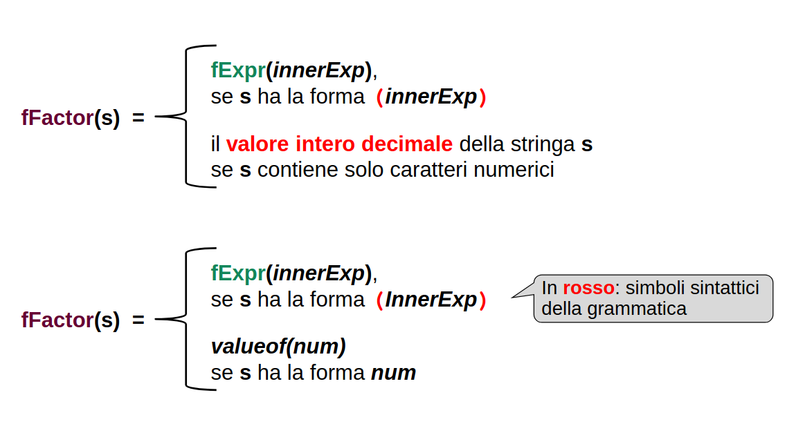

## Completare il parser
Fino ad adesso il parser è rimasto un puro riconoscitore, adesso vogliamo anche aggiungere semantica. Ovvero, aggiungere alla funzione di riconoscimento del parser anche una funzione di valutazione.
    - Solo dopo aver riconosciuto la frase (dominio) posso attivare la funzione di valutazione (funzione di interpretazione)
    - Valutare significa attribuire significato alle frasi, quindi serve la specifica della semantica che il parser dovrà applicare

### Ma come si specifica la semantica?
Occorre un modo sistematico e formale per stabilire con precisione e senza ambiguità il significato di ogni possibile frase del linguaggio
- se il linguaggio è finito, basta un elenco
- se è infinito, serve una notazione finita (applicabile a infinite frasi)

Un modo è definire una __funzione di interpretazione__
- DOMINIO: il linguaggio (insieme delle frasi lecite, ossia le stringhe riconosciute)
- CODOMINIO: l'insieme dei possibili significati, ossia l'insieme degli oggetti che si vogliono far corrispondere a tali frasi

__Come definire tale funzione?__
- se il linguaggio è finito, basta una tabella (stringhe -> significati)
- altrimenti, serve una funzione definita in modo __ricorsivo__

## Semantica denotazionale
Quando la semantica di un linguaggio è espressa tramite una funzione di interpretazione si parla di semantica denotazionale.

### COME DEFINIRLA?
IDEA FURBA: seguire pari pari la sintassi!
- per ogni regola sintattica, una regola semantica
- non si rischiano dimenticanze, mapping pulito e chiaro da leggere
- nel nostro caso la sintassi prevede Exp, Term e Factor -> la semantica prevedrà tre funzioni fExp, fTerm e fFactor

#### Semantica espressione

#### Semantica fattore

#### Semantica termine

OSS: per dare significato ad un nuovo simbolo devo utilizzare il significato di simboli che gia conosco

# MANDA MAIL
Cerca una sequenza di FATTORI.
Si ferma quando trova un token non
pertinente al suo sotto-linguaggio o
quando la stringa di input termina