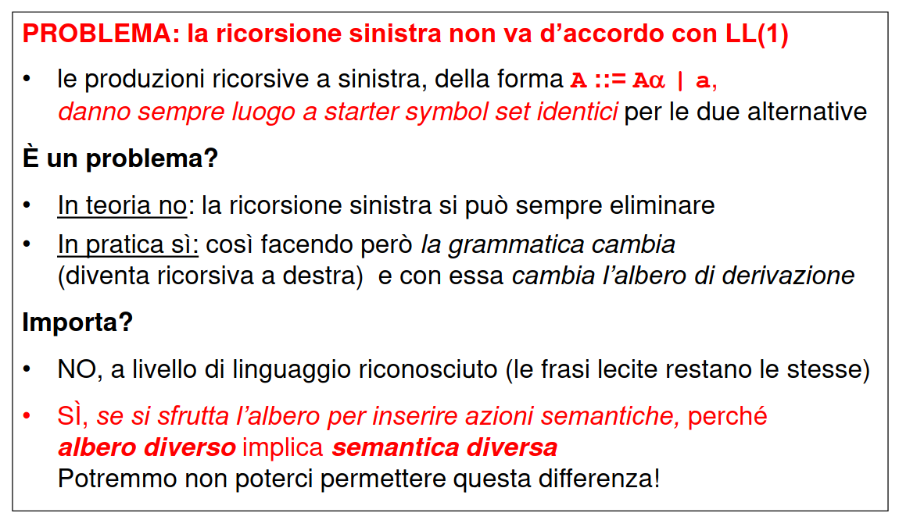

Fino ad adesso per l'implementazione del PDA avevamo chiare dalle regole della grammatica il simbolo iniziale della frase. A volte però queste iniziali non sono sempre disponibili fin da subito ma sono __nascoste da dei simboli non terminali__. In questi casi bisogna andare ad esplorare considerando più produzioni fino a capire l'iniziale per quel metasimbolo.

Questo porta a generalizzare il concetto di “simbolo iniziale”.

## Starter Symbol Set 
Tutti i simboli __iniziali__ terminali che riesci ad ottenere sviluppando alpha in tutti i modi possibili con le regole della grammatica.

### insieme First
Esiste anche un insieme analogo chiamato insieme __First__ che si ottiene con una definizione alternativa. Questo insieme denota le stesse iniziali di alpha ma può considerare anche epsilon per gestire anche i casi in cui una produzione può portare alla stringa vuota.

__OSS__: non bisogna limitarsi a guardare il primo simbolo nei casi in cui la grammatica contenga delle produzioni in cui il meta-simbolo iniziale possa scomparire.

### Generalizzazione per l'analisi ricorsiva discendente
Se __prima__ affermavamo che le parti destre delle produzioni relative a uno stesso meta-simbolo dovevano iniziare tutte con  __simboli terminali distinti__. __Ora__ generalizziamo l'idea affermando che le parti destre relative a produzioni di uno stesso meta-simbolo debbano essere caratterizzate da __starter symbol set distinti__.

    CONDIZIONE NECESSARIA perché una grammatica sia LL(1) (e che quindi sia possibile applicare l'analisi ricorsiva discendente) è che gli starter symbols relativi alle parti destre di uno stesso metasimbolo siano disgiunti per ogni produzione.

__NB__: la condizione diventa anche __sufficiente__ se nessun metasimbolo genera la stringa vuota.

---
vari esempi, guarda le slide...

---
## Perché la stringa vuota fa differenza?
- se una produzione genera la stringa vuota, quel meta-simbolo in realtà sparisce quando viene sostituito in un'altra regola
- ergo, regole che sembrano iniziare con un certo metasimbolo in realtà iniziano col successivo e questo va messo in conto

### Come risolvere
Una possibile soluzione è eliminare la stringa vuota, agendo per sostituzione
    - questo però risulta in una grammatica più complicata
    - e non si riesce a capire immediatamente se una grammatica è LL(1) o meno

#### Grammatiche sostanzialmente LL(1)
Quando una grammatica ha regole non deterministiche del tipo:

    A → a A | a 

essa viene detta: "sostanzialmente LL(1)" dato che una produzione di questo tipo si può riscrivere in maniera deterministica con una raccoglimento:

    A → a X
    X → a X | epsilon

### C’è una via più rapida per capire se una grammatica è LL(1), senza dover eliminare le epsilon-rules?
Sì, mettendo in conto a priori l’effetto delle eventuali epsilon-rules
- 1ª possibilità: agire sulla Parsing Table come: formalizzando il concetto di blocco annullabile e integrando nella tabella l'informazione sulle stringhe che possono scomparire
- 2ª possibilità: ampliare la nozione di Starter Symbols set come: estendendo la nozione di Starter Symbol set verso la più completa nozione di Director Symbols set (o Look-Ahead set)

### PARSING TABLE CON BLOCCHI ANNULLABILI
IDEA: costruire la Parsing Table tenendo conto delle epsilon-rules

__DEF | Blocco annullabile__: una stringa che può degenerare in epsilon

IL PUNTO:
- in presenza di blocchi annullabili, un metasimbolo che non sembrava iniziale può trovarsi "di fatto" a inizio frase
- per tenere conto delle epsilon-rules bisogna quindi considerare anche i simboli che possono seguire quelli annullabili 
    - __insieme FOLLOW__

### DIRECTOR SYMBOL SET
Gli starter set sono una definizione troppo semplicistica che mi obbliga a complicare la grammatica per gestire le epsilon. C'è bisogno di una definizione aggiuntiva.

Per tenere conto delle epsilon-rules bisogna considerare anche i simboli che possono seguire quelli annullabili 
- insieme FOLLOW

Un nuovo insieme caratterizzante:
- identico allo Starter Symbols quando non c'è la stringa vuota..
- … ma integrato dal nuovo insieme FOLLOW quando qualche produzione genera la stringa vuota (e quindi blocchi annullabili)
- definito quindi come __unione__ di due insiemi: __Starter symbol set, Following symbol set__

### CONDIZIONE LL(1) CON DIRECTOR SYMBOLS SET

    Condizione NECESSARIA E SUFFICIENTE perché una grammatica sia LL(1) è che i Director Symbols set relativi a produzioni alternative siano disgiunti.

Flash: Algoritmi che ti calcono i simboli di follow

### Il problema della ricorsione sinistra

Ricorda: la ricorsione sinistra può in teoria sempre essere sostituita con una ricorsione destra, tuttavia questa trasoformazione cambia l'ordine di derivazione e quindi cambia anche la semantica.

## Se la grammatica non è LL(1) che cosa si fa?
Varie strategie:
- si può cercare di riorganizzarla con sostituzioni, raccoglimenti, etc.
- oppure, si può cercare di modificare qualche regola "fastidiosa"
- oppure ancora, si può passare al caso LL(k), con k>1
    - le definizioni di FIRST, FOLLOW, etc. si estendono facilmente al caso LL(k) con k>1 → FIRSTk, FOLLOWk, etc.

Ma tutto ciò potrebbe non bastare. Non tutti i linguaggi context-free possiedono una grammatica LL(k)

    Esistono linguaggi DETERMINISTICI che non sono LL(k) per nessun k

Inoltre

    In generale non si può sapere se per un linguaggio ammetta una grammatica LL(1): stabilire se un linguaggio sia LL(1) è un problema INDECIDIBILE

Al contrario, ovviamente, stabilire se una grammatica sia LL(1) è un problema decidibile -> basta usare i Director Symbols

Come fare? __Esistono però tecniche più potenti dell'analisi LL!__

Le grammatiche LR(k) consentono l’analisi deterministica delle frasi Left to right, con Right-most derivation, usando k simboli di lookahead.
- L'analisi LR è meno naturale dell'analisi LL ma è superiore dal punto di vista teorico: «arriva dove l’LL non arriva»
- Infatti, vi sono linguaggi context-free deterministici non analizzabili in modo deterministico con tecniche LL, ma riconoscibili in modo deterministico con tecniche LR 
    - le vedremo più avanti ☺

### dangling else problem

    regole ambigue? NO!!!